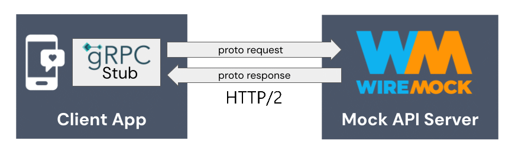

# WireMock Extension for gRPC

    

This extension allows you to use [WireMock](https://wiremock.org) to mock [gRPC](https://grpc.io/) services.

The extension scans for descriptor files (generated from the service’s .proto files) in the grpc subdirectory of WireMock’s root.
Using these, it converts incoming messages to JSON before passing them to WireMock’s core stubbing system
which allows the existing JSON matchers to be used when matching requests.
It also converts JSON responses back into proto messages so that
all of WireMock’s response definition features including Templating can be used.

The extension is distributed through Maven Central: `org.wiremock:grpc-extension`

## Examples

See [wiremock/wiremock-grpc-demos](https://github.com/wiremock/wiremock-grpc-demos/)

## Read More

See [the documentation](https://wiremock.org/docs/grpc/) for more information.

